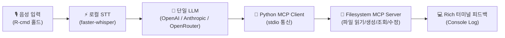

# 🎙️ Voice-Action AI v2.0 MVP (Voice-to-MCP)

> **"말 한마디로 표준 MCP 도구를 안정적으로 실행하는 지능형 macOS 음성 에이전트"**  
> Voice-Action v2.0 MVP는 **음성 입력(Push-to-Talk) ➔ 로컬 STT ➔ 단일 LLM 플래너 ➔ 표준 MCP(Filesystem) 도구 실행 ➔ Rich CLI 피드백**의 전체 파이프라인을 엔드투엔드로 검증하는 초경량 시스템입니다.

[](https://www.python.org/)
[](https://modelcontextprotocol.io/)
[](https://github.com/SYSTRAN/faster-whisper)
[]()

---

## 📌 1. 핵심 가설 & 단순화 원칙 (MVP Scope)

기존 v2.0 전체 아키텍처(로컬 Edge SLM 라우터, 다중 도메인 Lazy Loading, 4단계 리스크 가드, PySide6 반투명 HUD 등)에서 초기 디버깅 난이도를 낮추고 핵심 사용자 가치를 검증하기 위해 **철저한 가지치기(De-scoping)**를 적용했습니다.



| 영역 | v2.0 종합 계획서 (Full Spec) | **v2.0 초경량 MVP (현재 구현)** | 단순화 사유 |
| :--- | :--- | :--- | :--- |
| **1. 라우팅 레이어** | Apple Silicon MLX 로컬 SLM 멀티라벨 라우터 | **완전 생략 (No Router)** | 도메인 분류 없이 텍스트를 LLM으로 직결 |
| **2. LLM 추론 엔진** | 3단계 자동 폴백 (Claude ➔ DeepSeek ➔ GPT) | **단일 LLM Tool Calling** | OpenAI / Anthropic / OpenRouter 단일 호출 |
| **3. MCP 타깃 범위** | 다중 MCP (Filesystem + Playwright + AXUI) | **단일 표준 MCP (`@modelcontextprotocol/server-filesystem`)** | 로컬 파일시스템 제어로 부작용 최소화 및 검증 집중 |
| **4. 안전성 & Undo** | 4단계 가드, 모달 승인, SQLite Undo 저널 | **콘솔 로그 즉시 실행** | 즉각적인 피드백 루프 검증 |
| **5. UI / UX** | PySide6 Qt 반투명 다크모드 Floating HUD | **Rich 라이브러리 기반 컬러 터미널 CLI** | UI 스레드 충돌 없이 안정적 개발/디버깅 가능 |
| **6. 인터페이스** | Push-to-Talk 음성 전용 | **음성 / 단일 텍스트 명령 / 대화형 CLI 지원** | 마이크가 없는 환경이나 자동화 테스트에서도 즉시 검증 |

---

## 🧩 2. 시스템 아키텍처 & 프로젝트 구조

```
Mac-Command-Assistant/
├── voice-action/
│   ├── config.py             # 다중 프로바이더(OpenAI/Anthropic/OpenRouter), MCP 디렉토리 설정
│   ├── config.example.json   # 설정 템플릿
│   ├── audio.py              # sounddevice 기반 16kHz 모노 오디오 버퍼링 (v1 재사용)
│   ├── stt.py                # faster-whisper 온디바이스 로컬 STT (v1 재사용)
│   ├── mcp_client.py         # ★ 공식 Python MCP SDK 기반 stdio 어댑터 & 스키마 변환
│   ├── planner.py            # ★ 단일 LLM Function Calling 오케스트레이션 루프
│   ├── main.py               # ★ Rich 콘솔 인터페이스 & Push-to-Talk 이벤트 루프
│   ├── requirements.txt      # 프로젝트 의존성
│   └── tests/                # pytest 테스트 슈트
│       ├── test_config.py        # 설정 파일 및 환경변수 로딩 테스트
│       ├── test_mcp_client.py    # MCP stdio 연결 및 파일 작업 도구 테스트
│       ├── test_planner.py       # LLM Tool Calling 루프 모의 테스트
│       └── test_scenarios.py     # PRD 검증 시나리오 1/2/3 E2E 테스트
└── README.md
```

---

## 🚀 3. 빠른 시작 (Getting Started)

### 사전 요구사항 (Prerequisites)
- **macOS** (Apple Silicon 또는 Intel)
- **Python 3.10+**
- **Node.js (v18+) & npx** (`npx -y @modelcontextprotocol/server-filesystem` 구동용)

### 1) 설치
```bash
# 1. 저장소 이동
cd voice-action

# 2. 가상환경 생성 및 활성화
python3 -m venv venv
source venv/bin/activate

# 3. 의존성 설치
pip install -r requirements.txt
```

### 2) 설정 파일 작성 (`config.json`)
`config.example.json`을 복사하여 `config.json`을 생성하거나 환경변수를 설정합니다.

```json
{
  "provider": "openai",
  "model": "gpt-4o-mini",
  "openai_api_key": "YOUR_OPENAI_API_KEY",
  "allowed_directories": [
    "~/Desktop",
    "~/Documents/test_workspace"
  ],
  "whisper_model": "small",
  "hotkey": "cmd_r"
}
```
> *(Anthropic 사용 시 `"provider": "anthropic"`, `"model": "claude-3-5-sonnet-20241022"`, `"anthropic_api_key": "..."` 로 설정)*

---

## 🎮 4. 사용 방법 (Usage)

### ① Push-to-Talk 음성 모드 (기본)
```bash
python main.py
```
- **조작법**: 오른쪽 커맨드(`R-cmd`) 키를 누른 상태에서 말하고, 발화가 끝나면 키를 뗍니다.
- **상태 흐름**:
  `[대기 중...]` ➔ `[🔴 녹음 중 (R-cmd)...]` ➔ `[⚡ STT 변환 완료]` ➔ `[🤖 LLM 플래닝 중...]` ➔ `[🔌 MCP 실행 로그]` ➔ `[✅ 완료 요약]`

### ② 단일 텍스트 명령 모드 (마이크 없이 즉시 테스트)
```bash
python main.py --text "바탕화면에 있는 파일 목록 보여줘"
python main.py --text "테스트 폴더에 오늘 날짜로 메모장 파일 하나 만들어줘"
```

### ③ 대화형 터미널 콘솔 모드 (Interactive REPL)
```bash
python main.py --interactive
```

### ④ 환경 및 설정 진단
```bash
python main.py --check
```

---

## 🧪 5. 검증 및 테스트 시나리오 (Test & Verification)

PRD 제5장에 정의된 3대 핵심 검증 시나리오를 포함한 자동화 테스트를 실행합니다.

```bash
pytest tests/ -v
```

### 📋 검증 시나리오 결과
1. **조회 테스트**: *"바탕화면에 있는 파일 목록 보여줘"*  
   ➔ `list_directory` 도구 자동 호출 ➔ 디렉토리 내 파일 목록 반환 (`PASSED`)
2. **생성 테스트**: *"테스트 폴더에 오늘 날짜로 메모장 파일 하나 만들어줘"*  
   ➔ `write_file` 도구 자동 호출 ➔ 대상 디렉토리에 메모 파일 실제 생성 (`PASSED`)
3. **복합 내용 작성 테스트**: *"README.md 파일 읽고 요약해서 summary.txt로 저장해줘"*  
   ➔ `read_text_file` ➔ 요약 추론 ➔ `write_file` 순차 호출 및 완료 (`PASSED`)

```
============================== 8 passed in 4.20s ===============================
```

---

## 🗺️ 6. 향후 로드맵 (Post-MVP)

1. **Playwright MCP 연동**: 웹 검색 및 페이지 스크랩/브라우저 조작 도구 확장
2. **PySide6 미니멀 플로팅 HUD**: 터미널을 보지 않고도 바탕화면에서 상태를 볼 수 있는 최소 오버레이 UI
3. **로컬 Edge Router (SLM)**: 다중 MCP 도메인 확장 시 도구 스키마를 선별하는 온디바이스 라우터 도입
4. **Risk Guard & Undo**: 파일 삭제/수정 등 비가역 명령에 대한 확인창 및 롤백 저널 지원

---

## 👥 7. 멀티에이전트 개발 체계

| 에이전트 역할 | 담당 영역 및 산출물 |
| :--- | :--- |
| **총괄 (Orchestrator)** | 시스템 설계, 모듈 인터페이스 정의, 컴포넌트 통합 조율 |
| **Audio & STT Dev** | `audio.py`, `stt.py` (Push-to-Talk 캡처 및 로컬 Whisper 트랜스크립션) |
| **MCP Client Dev** | `mcp_client.py` (공식 Python MCP SDK stdio 클라이언트, 스키마 변환) |
| **LLM Planner Dev** | `planner.py` (OpenAI / Anthropic Tool Calling 오케스트레이션 루프) |
| **CLI Core Dev** | `config.py`, `main.py` (Rich 기반 컬러 터미널 대시보드 및 이벤트 파이프라인) |
| **테스터 (QA Agent)** | `tests/` (8개 단위/통합/시나리오 테스트 슈트 구축 및 검증) |
| **문서 & Git Agent** | `README.md`, `requirements.txt`, 설정 가이드 작성 및 Git 형상 관리 |
