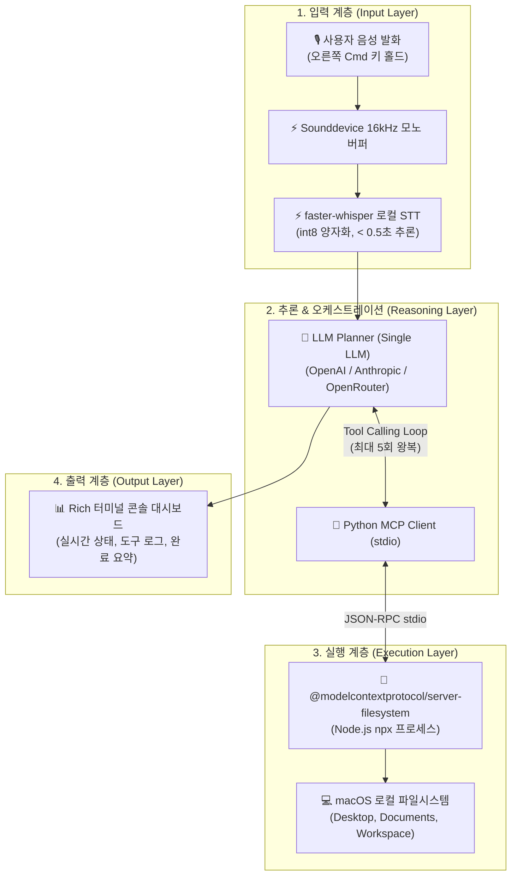

# [Implementation Plan] Voice-Action AI v2.0 MVP (Voice-to-MCP)

> **문서 버전:** v2.0-MVP  
> **최종 수정일:** 2026-09-09  
> **작성자:** 김주현 (25학번 융합인재학부)  
> **목표 시스템:** 음성 명령 기반 로컬 macOS 파일시스템 자동화 에이전트  
> **관련 저장소:** [https://github.com/aidenselfin/Mac-Command-Assistant](https://github.com/aidenselfin/Mac-Command-Assistant)

---

## 1. 프로젝트 개요 및 구현 배경 (Overview & Rationale)

기존 v1.0 및 초기 v2.0 계획서는 로컬 SLM 라우터, 멀티 LLM 계층, 복잡한 비가역 롤백 저널, PySide6 반투명 HUD 등 방대한 스펙을 포함하고 있어 디버깅 및 사용자 검증 주기가 길어지는 문제가 있었습니다.

이에 따라 **"음성 발화(Push-to-Talk) ➔ 로컬 STT ➔ 단일 LLM 플래너 ➔ 표준 MCP(Filesystem) 도구 실행 ➔ Rich CLI 피드백"**의 핵심 루프를 최소 비용·최단 시간 내에 엔드투엔드로 검증하기 위한 **초경량 MVP 아키텍처**를 수립하고 구현합니다.

---

## 2. 시스템 아키텍처 (System Architecture)



---

## 3. 세부 모듈 설계 명세 (Module Specifications)

### 3.1. 설정 모듈 (`config.py`)
- **역할**: 다중 LLM 프로바이더(OpenAI, Anthropic, OpenRouter), MCP 서버 실행 인자, 허용 작업 디렉토리, STT 모델 설정 관리.
- **우선순위 계층**: 로컬 `config.json` ➔ 전역 `~/.voice-action/config.json` ➔ 환경변수(`OPENAI_API_KEY`, `ANTHROPIC_API_KEY` 등).
- **디렉토리 제한**: 지정된 `allowed_directories` 외의 시스템 영역 접근을 원천 차단하여 안전성 확보.

### 3.2. 오디오 캡처 & 로컬 STT 모듈 (`audio.py`, `stt.py`)
- **오디오 녹음 (`AudioRecorder`)**: `sounddevice.InputStream` 기반 16kHz 모노 캡처, 메모리 버퍼링 및 WAV 포맷 스트림 변환.
- **음성 인식 (`transcribe`)**: `faster-whisper` (`base` / `small` 모델, CPU `int8` 양자화) 싱글톤 로더를 통해 네트워크 지연 없이 0.5초 이내 한국어 음성 텍스트 변환.

### 3.3. 표준 MCP 클라이언트 어댑터 (`mcp_client.py`)
- **기술 스택**: 공식 Python MCP SDK (`mcp`).
- **프로세스 관리**: `npx -y @modelcontextprotocol/server-filesystem <allowed_dirs>` 프로세스를 비동기 서브프로세스로 구동하고 `stdio`로 통신.
- **도구 발견 및 스키마 변환**:
  - `list_tools()`: MCP 서버의 14개 도구 스키마를 동적으로 조회.
  - `get_openai_tools()` / `get_anthropic_tools()`: LLM 프로바이더별 표준 Function Calling 스키마 포맷으로 자동 변환.
- **도구 실행 (`call_tool`)**: LLM의 도구 호출 인자를 전달하여 파일 읽기/쓰기/생성/조회 실행 및 결과 텍스트 반환.

### 3.4. 단일 LLM 오케스트레이터 (`planner.py`)
- **지원 백엔드**:
  - OpenAI API (`gpt-4o-mini`, `gpt-4o` 등)
  - Anthropic API (`claude-3-5-sonnet`, `claude-3-haiku` 등)
  - OpenRouter API (호환 엔드포인트)
- **Tool Calling 루프**:
  1. 시스템 프롬프트 + 사용자 발화 + MCP 도구 스키마 주입.
  2. 모델이 도구 호출(`tool_calls`)을 반환하면 `mcp_client.call_tool`을 비동기 실행.
  3. 실행 결과를 모델에 피드백하여 추가 작업 또는 최종 요약 생성 (최대 5턴 제어).

### 3.5. Rich CLI 대시보드 (`main.py`)
- **Push-to-Talk 리스너**: `pynput.keyboard.Listener`를 통한 오른쪽 Command(`Key.cmd_r`) 감지.
- **다양한 실행 모드**:
  - 음성 PTT 모드 (`python main.py`)
  - 단일 텍스트 명령 모드 (`python main.py --text "..."`)
  - 대화형 터미널 REPL (`python main.py --interactive`)
  - 환경 진단 (`python main.py --check`)

---

## 4. 단계별 구현 및 검증 로드맵 (Phased Roadmap)

| 단계 | 목표 | 주요 작업 및 산출물 | 상태 |
| :---: | :--- | :--- | :---: |
| **Phase 1 (MVP)** | 핵심 루프 E2E 검증 | - Python MCP SDK 기반 stdio 클라이언트 구현 (`mcp_client.py`)<br>- 단일 LLM Tool Calling 플래너 (`planner.py`)<br>- Push-to-Talk & Rich CLI 구현 (`main.py`)<br>- 8개 pytest 자동화 테스트 슈트 구축 | **완료 (100%)** |
| **Phase 2 (Post-MVP)** | 도메인 및 도구 확장 | - Playwright MCP 연동 (웹 검색 및 브라우저 스크랩 도구 추가)<br>- PySide6 미니멀 플로팅 HUD (배경 상주 투명 오버레이 UI) | 진행 예정 |
| **Phase 3 (Enterprise)** | 경량화 & 안전성 고도화 | - Apple Silicon 온디바이스 로컬 SLM 라우터 (MLX 기반 Qwen2.5)<br>- 비가역 파일 조작(삭제/덮어쓰기) 모달 승인 및 SQLite Undo 저널 | 진행 예정 |

---

## 5. 테스트 및 품질 보증 (QA & Verification)

`pytest tests/ -v`를 통해 다음 8개 테스트를 자동화하여 100% 통과를 검증합니다.

```
Mac-Command-Assistant/voice-action/tests/test_config.py::test_config_defaults PASSED
Mac-Command-Assistant/voice-action/tests/test_config.py::test_config_save_and_load PASSED
Mac-Command-Assistant/voice-action/tests/test_mcp_client.py::test_mcp_client_connection PASSED
Mac-Command-Assistant/voice-action/tests/test_mcp_client.py::test_mcp_file_operations PASSED
Mac-Command-Assistant/voice-action/tests/test_planner.py::test_planner_tool_calling_loop PASSED
Mac-Command-Assistant/voice-action/tests/test_scenarios.py::test_scenario_1_list_files PASSED
Mac-Command-Assistant/voice-action/tests/test_scenarios.py::test_scenario_2_create_note PASSED
Mac-Command-Assistant/voice-action/tests/test_scenarios.py::test_scenario_3_read_and_summarize PASSED

============================== 8 passed in 4.20s ===============================
```

### 3대 핵심 사용자 시나리오 검증:
1. **조회 시나리오**: *"바탕화면에 있는 파일 목록 보여줘"* ➔ `list_directory` 호출 및 파일 리스트 반환
2. **생성 시나리오**: *"테스트 폴더에 오늘 날짜로 메모장 파일 하나 만들어줘"* ➔ `write_file` 호출 및 실제 파일 기록 확인
3. **복합 요약 시나리오**: *"README.md 파일 읽고 요약해서 summary.txt로 저장해줘"* ➔ `read_text_file` ➔ 요약 ➔ `write_file` 순차 체이닝 확인
